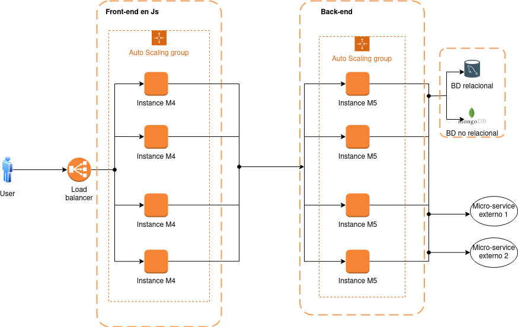

# Prueba 1 - Diagrma de red

## Introducción 
A continuación lo que se busca es poder diseñar un diagrama de red empleando la herramienta **draw.io**, de una aplicación web en AWS. Se busca cumplir con lo solicitado en base a lo que el diseño debe soportar:
- Cargas variables.
- Contar con HA (Alta disponibilidad).
- Backend con una base de datos relacional y una no relacional.
- La aplicación backend consume 2 microservicios externos.

## Desarrollo
### Diseño e implementación

*Figura 1: Diagrama de red implementado*

Como se mencionó anteriormente se utilizó la herramienta online y gratuita **draw.io**, se decidio emplearla debido a que proporcionaba librerías e imágenes/iconos sumamente necesarios para realizar el diseño. Además de ser simple, sencilla e intuitiva a la hora de diagramar.

Para poder cumplir con el requerimiento de tener tanto una carga variable como contar con una alta disponibilidad, se utilizó al principo de nuestra arquitectura un balanceador de carga, el mismo tiene como finalidad determinar hacía donde distribuir el tráfico entrante como así también conocer si es que uno de nuestros componentes falla poder redirigirlo a uno nuevo manteniendo la disponibilidad para que los usuarios vean la menor cantidad de errores posibles. Esta parte de la insfrestructura optimiza el rendimiento y la disponibilidad de un servicio al distribuir las solicitudes a lo largo de múltiples recursos de la red. La idea es que utilice información expuesta por los servidores para determinar cual recibirá la solicitud, esta información es por lo general la carga actual del servidor. (Algorítmo de balanceo dinámico).

Luego de este load balancer se encuentra diferentes instancias M4 de AWS las cuales representan el fornt-end de nuestra aplicación en donde se puede ver que los mismos poseen un auto escalamiento, esto nos permite que a una mayor demanda tengamos un crecimiento horizontal de las máquinas logrando así cubrir nuevamente la alta disponibilidad necesaria en estos casos.
El tipo de instancia que especifique determinará el hardware del equipo host utilizado para la instancia. Cada tipo de instancia ofrece distintas características de computación, memoria y almacenamiento, y se agrupa en una familia de instancias en función de dichas características. El utilizado (M4) es proporcionado por Amazon EC2 (Amazon Elastic Compute Cloud) y su caso de uso es un fin general.

A posterior tenemos luego de las instancias que representan el backend otras instancias M5 (instancia de uso general), las cuales también tendrán un auto escalamiento en el caso de ser necesario y se comunican con las bases de datos tanto relacional y no relacional, como así también con micro servicio externos.

## Aclaraciones:
- Se podría implementar el uso de una caché si es que tendriamos un servidor expuesto a un gran número de peticiones. Esto nos permitiría que si existen peticiones que se repiten mucho y la respuesta es siempre la misma, estas se puede cachear obteniendo así no solo una respuesta más rápida si no también liberando la carga del servidor, pudiendo dedicarse a otras peticiones y por lo tanto, soportando una mayor carga de peticiones en general.

## Referencias
Enlaces:
- [Herramienta de diseño draw io](https://app.diagrams.net/)
- [Tipos de instancias en AWS](https://docs.aws.amazon.com/es_es/AWSEC2/latest/WindowsGuide/instance-types.html)
---
