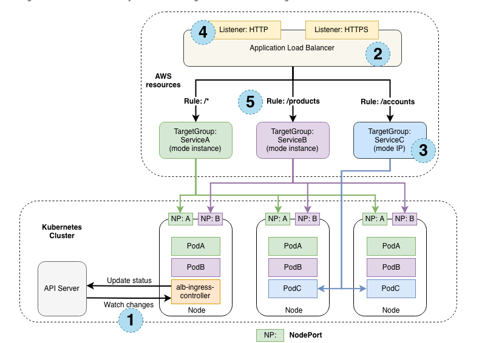

# Prueba 2 - Despliegue de una aplicación Django y React.js

## Dockerizar la aplicación front-end y backend

Para poder llevar a cabo la dockerización de la app, lo primero que se hizo fue diseñar los Dockerfile para cada uno de los componentes, debido a que con los mismos nos permitira poder builder una imagen y con esta levantar los contenedores necesarios.
Los Dockerfile tanto del backend como del frontend se encuentran en sus correspondientes directorios, ../backend y ../forntend

### Dockerfile backend
- En una primera instancia se trato de usar como base (FROM python:3.7-alpine) la misma genero una serie de inconvenientes al momento de llevar a cabo la instalación de las dependencias necesarias para la app Django, entre ellas *Psycopg, Psycopg-binary, gcc*, entre otras. Se pudo solucionar algunas de ellas como por ejemplo psycopg instlando los paquetes necesarios como  *gcc musl-dev postgresql-dev*. A medida que se solucinoban estos problemas surgian otros por lo tanto se investigo si realmente emplear una imagen de base como alpine era lo más óptimo y se pudo determinar que esta imagen de base se emplea para ciertas cosas en especificas y que por lo general se utiliza una imagen de python *slim buster* que fue con la cual se realizó el Dockerfile.
- Una vez que se buildeo la imagen, se buscó disminuir su tamaño para esto se removieron en la capa en la cual se instalan las dependecias, remover aquellas que ya no nos hacen falta.
**Para poder buildear la imagen se usa el siguiente comando:**
```shell
$ cd ../backend
$ docker build -t <app-name>:<tag> .
```

#### Referencias utilizadas
Enlaces:
- [DockerFile reference](https://docs.docker.com/engine/reference/builder/)
- [installing psycopg2 on Alpine in Docker](https://stackoverflow.com/questions/46711990/error-pg-config-executable-not-found-when-installing-psycopg2-on-alpine-in-dock)
- [psycopg-issues](https://github.com/psycopg/psycopg2/issues/684)
- [containers with alpine linux](https://shivering-isles.com/docker-minimize-your-containers-with-alpine-linux)
---

#### Dockerfile frontend
- En el Dockerfile del frontend no se tuvo mayores inconveniente empleando una imagen base de (node:14-alpine).
**Para poder buildear la imagen se debe colocar el siguinte comando.**

```shell
$ cd ../frontend
$ docker build -t <app-name>:<tag> .
```

#### Referencias utilizadas
Enlaces:
- [DockerFile reference](https://docs.docker.com/engine/reference/builder/)
- [Docker in Your React.Js Application](https://medium.com/geekculture/getting-started-with-docker-in-your-react-js-application-the-basics-6e5300cf749d)
---

#### Docker-compose
- En el siguiente apartado se busca realizar el docker-compose el mismo nos permitirá poder simplificar las cosas mediante este archivo tipo .yaml. que nos permite poder levantar todo lo necesario de una sola vez.
- Una de las cuestiones que se debio resolver es la inclusión de una BD dado que la parte del backend necesita poder utilizar una. Se eligio emplear posgresDB.
- Además cabe aclarar que fue necesario determinar un variable de entorno para SECRET_KEY dado que sin ella el contendor no inicia. Todo esto se pudo resolver haciendo uso del comando *docker logs <id_container>*

#### Referencias utilizadas
Enlaces:
- [Docker-compose](https://docs.docker.com/compose/)
- [Environment-variables](https://docs.docker.com/compose/environment-variables/)
- [Compose and Django](https://docs.docker.com/samples/django/)
---

### Guia para deploy de services usando kubernetes
- Crear los archivos de kubernetes necesarios, para esto se emplea el siguiente comando:

```shell
$ kompose convert -o ../kubernetes/
```
*Aclaración: [Previamente debemos instalar kompose](https://kompose.io/installation/)* 
- Una vez que obtenemos los archivos que generamos se busca poder corroborar su funcionamiento en minikube
  - Creamos un namespace:
    ``` shell
    $ kubectl create namespace <namespace name>
    ```
  -  Nos movemos a ese namespace 
    ``` shell
    $ kubectl config set-context NAME [--cluster=cluster_nickname] [--user=user_nickname] [--namespace=namespace]
    ```
  -  Al momento de levantar los archivos correspondiente se puede ver que tanto en el deployment del backend como del frontend la imagen que solicita buscar no se encucentra debido a que nosotros la generamos de manera local. Por esto se suben dichas imagenes a dockerhub.
  -  Como en el docker-compose la db no tenia un port asignado explicitamente dado que se comunicaba internamente con el back al momento de generar los files necesarios con *kompose* no se genero un service. Es por esta razón que se debe generar un service necesariamente dado que para poder comunicar nuestros pods se requiere de este.
  -  Una vez que tenemos todos los archivos debemos poder "aplicarlos" con el siguiente comando:
  ```shell
  $ kubectl apply -f ../Kubernetes/.
  ```
### Servicio de ingress
- En este aparatado se dicidio poder agregar un service de ingress el cual nos va a pertmitir además de funcionar como un balanceador de carga (laod balancer) redirigir el tráfico que llegue a nuestro cluster, comunicarse con los servicios en cuestión y consumir los pods necesarios de nustra app. Es decir tener acceso a nuestros servicios basados en un path.



*Figura 1: Diagrama de un ingress*

Para poder generar un ingress empleando amazon AWS se debería seguir el siguiente enlace:

[Ingress controller in AWS](https://aws.amazon.com/blogs/opensource/kubernetes-ingress-aws-alb-ingress-controller/)

Una vez generado nuestro ingress se debería aplicar con el siguiente comando:
``` shell
$ kubectl apply -f ../kubernetes/ingress-controller.yaml
```

#### Referencias utilizadas
Enlaces:
- [Service ingress](https://kubernetes.io/docs/concepts/services-networking/ingress/)
- [Ingress controller in AWS](https://aws.amazon.com/blogs/opensource/kubernetes-ingress-aws-alb-ingress-controller/)
---

