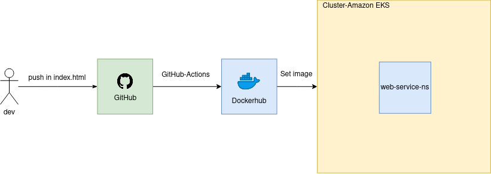

# Prueba 3 - CI/CD

## Dockerizar el nginx

- Para poder dockerizar el nginx se creo su Dockerfile correspondiente y luego mediante un docker-compose que se encuentra en este directorio se llevo a cabo el seteo de los ports como así también del volumenes necesarios.

#### Referencias utilizadas
Enlaces:
- [Dockerhub nginx](https://hub.docker.com/_/nginx)
---

### Elaboración del pipeline
- Luego para poder llevar a cabo que mediante un cambio sobre el archivo index.html se genere (buildee) una nueva imagen en el repositorio de dockerhub se utilizo github-actions, teniendo en cuenta que solo debe efectuar una actions cuando se medofica el index.html.

#### Referencias utilizadas
Enlaces:
- [CI/CD github-actions](https://docs.docker.com/ci-cd/github-actions/)
- [Crear una accion en github-actions](https://docs.github.com/es/actions/creating-actions/creating-a-docker-container-action)
---

### Deploy de la imagen en una plataforma (kubernetes)
- Para poder cumplir con este apartado fue necesario obtener los archivos pertinentes empleados por kubernetes, para esto se volvió a hacer uso del siguiente comando:

```shell
$ kompose convert -o ../kubernetes-web-service/
```
- Una vez que se tienen los archivos necesarios, debemos crear un namespaces en nuestro cluster:

```shell
$ kubectl create namespace web-service-ns
```
- Aplicamos nuestros archivos en dicho namespace previamente moviendonos al mismo:

``` shell
    $ kubectl config set-context NAME [--cluster=cluster_nickname] [--user=user_nickname] --namespace=web-service-ns
    $ kubectl apply -f ../kubernetes-web-service/.
```
- Se agrega al workflows llamado push.yaml, la parte para poder hacer el deploy en nuestro cluster, para ello se uso un actions de **Kubernetes AWS/EKS Action**. La cual necesita además de las credenciales de AWS:
``` shell
    secrets.AWS_ACCESS_KEY_ID
    secrets.AWS_SECRET_ACCESS_KEY
```
Como la configuración de **KUBE_CONFIG_DATA**.



*Figura 1: Diagrama del deploy*

#### Referencias utilizadas
Enlaces:
- [Actions empleada: Kubernetes AWS/EKS Action](https://github.com/marketplace/actions/kubernetes-aws-eks-action)
---
